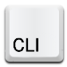

<h1 align="center">Compile-AHK CLI</h1>

<!--  -->

<div style="display: flex; justify-content: center; align-items: center; margin-bottom: 20px; flex-direction: column;">


</div>

## Overview



Compile-AHK is a **Featureful** script designed to **Simplify** and **Enhance** the process of **Compiling**, **Executing** and **Developing** AutoHotkey scripts with **Enhanced CLI Functionalities**. It allows for easy compilation and execution of AHK scripts and **Watch** for changes with various customization options such as architecture selection, compression, resource embedding, and more.

## Features

- Supports AutoHotkey **v1** and **v2** compilation
- Compatible with both **32** and **64** bit architectures
- Allows compression using [**UPX**][3] and [**MPRESS**][4]
- Customizable output directories and filenames
- Supports resource embedding and icon customization
- **Pre-** and **Post-build** command execution
- **Watch** mode for automatic re-execution on file change
- **Awesome** and **Colorful** verbose logging and informative error handling [See](#logging--debugging)
- **Exit Codes** for better integration with other scripts and tools [See](#exit-codes)

## Installation

1. Clone this repo or download one of the [**Releases**][7].
2. Place the `compile-ahk` path in a globally accessible location.

## Usage

Run the script using the following syntax: (in **No** perticular order)

```
$ compile-ahk [-f, --file] <file|dir> [Args] [Options]
```

[Args] are the Arguments to be passed to ahk file in watch mode.

[Options] are the folowing:

- **Short**
  
| Flag          | Short |   Value    | Description                                                                  |
| ------------- | :---: | :--------: | ---------------------------------------------------------------------------- |
| `--file`      | `-f`  |  `<path>`  | Specify the input AHK script file or directory. (regex: `\.ahk[12]?$`)       |
| `--dir`       | `-d`  |  `<path>`  | Define the executable output directory. (default: `dist`)                    |
| `--versions`  | `-v`  |  `<list>`  | Compile for multiple versions. (e.g, `"32 64 "32-mpress" ..."`)              |
| `--icon`      | `-i`  |  `<icon>`  | Set a custom icon for the executable.                                        |
| `--compress`  | `-c`  | `<method>` | Select a compression method (`mpress` or `upx`).                             |
| `--arch`      | `-a`  | `<32\|64>` | Choose between 32 and 64 bit AutoHotkey architectures. (default: `sys_arch`) |
| `--resource`  | `-r`  | `<res-id>` | Specify resource ID.                                                         |
| `--seperator` | `-s`  |  `<char>`  | Define the separator between name and versions. (default: `-`)               |
| `--codepage`  | `-p`  |  `<code>`  | Specify codepage.                                                            |
| `--watch`     | `-w`  |            | Watch ahk file for changes and execute them.                                 |
| `--quiet`     | `-q`  |            | Disable verbose output.                                                      |
| `--msg`       | `-m`  |            | Use default msgbox output.                                                   |
| `--clean`     | `-n`  |            | Clear the output directory before compilation.                               |
| `--gui`       | `-g`  |            | Use the GUI version of the compiler.                                         |
| `--help`      | `-h`  |            | Display help menu.                                                           |

- **Long**

| Flag           |   Value    | Description                                    |
| -------------- | :--------: | ---------------------------------------------- |
| `--pre-build`  |  `<cmd>`   | Register a pre-build script or command.        |
| `--post-build` |  `<cmd>`   | Register a post-build script or command.       |
| `--ahk-dir`    |  `<path>`  | Specify the AutoHotkey installation directory. |
| `--ahk-ver`    | `<v1\|v2>` | Set the AutoHotkey version. (default: `v2`)    |
| `--no-emit`    |            | Don't Emit executable files.                   |
| `--no-exit`    |            | Don't Exit on fatal errors. (e.g, syntax)      |

### Details

- `-f, --file` flag is **optional**, but the file path is required, **else** the script will find the **first ahk file** in current directry. To input a directory, add a slash at the end of the path. like `compile-ahk -f mydir/`, and the script will find the **first ahk file**.
- `-v, --versions` flag can control: **Architecture**, and **Compression** methods ( overwrites `-c, --compress` and `-a, --arch` flags )

### Default parameters

- **versions** = `"32 64 32-mpress 64-mpress 32-upx 64-upx"`
- **ahk_dir** = `"%ProgramFiles%\AutoHotkey"`
- **ahk_exe** = `"%bin_compiler%\Ahk2Exe.exe"` and `"%ahk_dir%\Ahk2Exe.exe"`
- **ahk_out_dir** = `"dist"`
- **ahk_in_file** = `"*.ahk"` first match
- **ahk_arch** = `"!sys_arch!"`
- **ahk_ver** = `"v2"`
- **compressor** = `""`
- **resource** = `""`
- **clean** = `""` if true → clean every compilation
- **icon** = `""`
- **sp** = `"-"`
- **pre-build** = `""`
- **post-build** = `""`

> [!TIP]
> For more tuning Check `__global-vars__` to match the script to your specific needs.

## Examples

### Watch Mode

```
$ compile-ahk --watch myscript.ahk arg1 arg2 ...
```

### Basic Compilation

```
$ compile-ahk myscript.ahk
```

Compiles `myscript.ahk` using default settings. This will give:

- `./dist/myscript-64.exe`
- `./dist/myscript-32.exe`
- `./dist/myscript-64-upx.exe`
- `./dist/myscript-32-upx.exe`
- `./dist/myscript-64-mpress.exe`
- `./dist/myscript-32-mpress.exe`

### Specify Output Directory and Versions

```
$ compile-ahk -f myscript.ahk -d build -v "32 64 64-mpress"
```

<details>
    <summary>Output</summary>

- `./build/myscript-64.exe`
- `./build/myscript-32.exe`
- `./build/myscript-64-mpress.exe`

</details>

Compiles `myscript.ahk` into `output/` with multiple architecture and compression settings.

### Set Custom Ico,  Enable Compression and Force an Arch

```
$ compile-ahk -f myscript.ahk -i myicon.ico -c upx -a 32 -v " 64 "" " -s "_x"
```

<details>
    <summary>Output</summary>

- `./dist/myscript.exe` → 32bit
- `./dist/myscript_x64.exe` → 64bit

</details>

Force using **32bit Arch** for unknown version like `""`, uses `myicon.ico` as the application icon and compresses the executable using UPX.

### Run Pre- and Post-Build Commands

```
$ compile-ahk -f myscript.ahk --pre-build "set "AHK_ENV=BUILD"" --post-build "7z a "./build.zip" "dist/""
```

<details>
    <summary>Output</summary>

- `./build.zip`
- `./dist/myscript-64.exe`
- `./dist/myscript-32.exe`
- ...

</details>

Set AHK_ENV to BUILD **before** compiling and Execute 7z to bundle output executables to a zip file **after** compiling.

## Logging & Debugging

The script provides log messages for different levels:

- `[INFO]` - General information about the process.
- `[WARN]` - Warnings about potential issues.
- `[ERROR]` - Errors that prevent successful compilation.
- `[SUCCESS]` - Indicates a successful build or execution.

## Exit Codes

- `0` - Successful execution or compilation.
- `1` - Error during pre-compilation checks.
- `2` - Compilation failure (fatal error).

<!-- 

## Error Handling

If the script encounters an error, it will display a message indicating the issue. Common errors include:

- Missing AHK compiler (`Ahk2Exe.exe`)
- Invalid AHK script file path
- Unsupported compression method 
- ...

-->

---

<div>
    <div>
        <span>Author: <a href="https://github.com/benzaria/">Benzaria</a></span>
        <span style="float: right;">LICENSE: <a href="./LICENSE">MIT</a></span>
    </div>
    <div>
        <span>Version: 1.2</span>
        <span style="float: right;">Updated: 20/03/2005</span>
    </div>
</div>

[0]: https://github.com/benzaria/ "me"
[1]: https://www.autohotkey.com/ "ahk"
[2]: https://www.autohotkey.com/docs/Scripts.htm#ahk2exe "ahk2exe"
[3]: https://upx.github.io/ "upx"
[4]: https://www.matcode.com/mpress.htm "mpress"
[6]: https://github.com/benzaria/compile-ahk "compile-ahk"
[7]: https://github.com/benzaria/compile-ahk/releases "releases"
